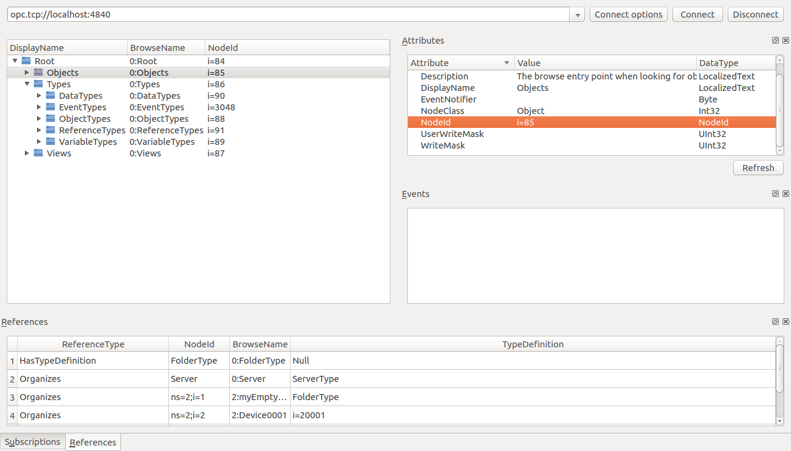
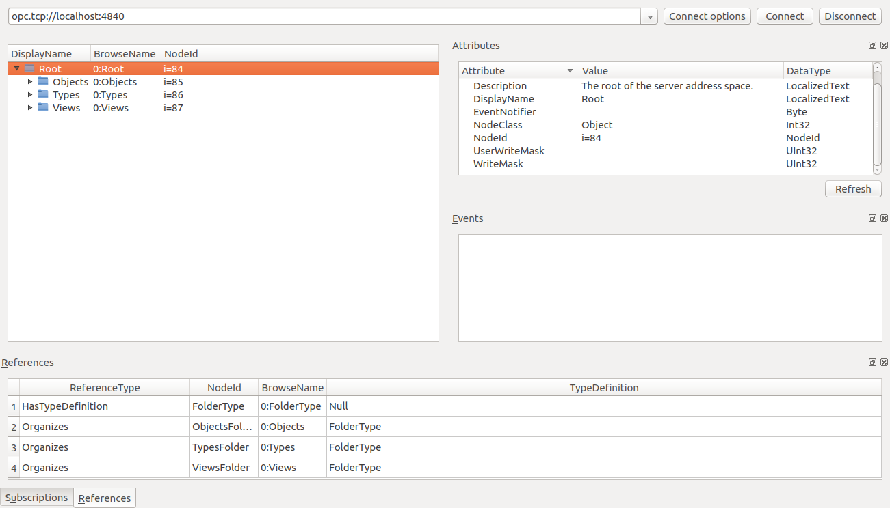

# FreeOpcUa opcua-client-gui Check

## opcua-client-gui


## server-example.py Hacking

```Shell
zengjf@zengjf:~/zengjf/zengjfos/OpcUaDocs/python-opcua/examples$ python3 server-example.py 
WARNING:opcua.server.binary_server_asyncio:Listening on 0.0.0.0:4840
Available loggers are:  dict_keys(['opcua.server', 'opcua.server.address_space', 'opcua.server.server', 'opcua.server.event_generator', 'opcua.server.subscription_service', 'opcua.uaprotocol', 'opcua.ua.uatypes', 'opcua.common.xmlimporter', 'opcua.common.instantiate', 'asyncio', 'opcua.server.history', 'opcua.common.xmlparser', '__name__', 'opcua.server.internal_server', 'opcua.common.utils', 'opcua.common.copy_node', 'concurrent', 'concurrent.futures', 'opcua', 'opcua.common', 'opcua.server.binary_server_asyncio', 'opcua.ua'])
Python 3.5.2+ (default, Sep 22 2016, 12:18:14) 
[GCC 6.2.0 20160927] on linux
Type "help", "copyright", "credits" or "license" for more information.
(InteractiveConsole)
>>>      
```

### 创建一个节点类型

```Python
# create a new node type we can instantiate in our address space
dev = server.nodes.base_object_type.add_object_type(0, "MyDevice")
dev.add_variable(0, "sensor1", 1.0)
dev.add_property(0, "device_id", "0340")
ctrl = dev.add_object(0, "controller")
ctrl.add_property(0, "state", "Idle")

```


### 创建文件夹

```Python
# First a folder to organise our nodes
myfolder = server.nodes.objects.add_folder(idx, "myEmptyFolder")
```


### 实例化MyDevice类型的实例

```Python
# instanciate one instance of our device
mydevice = server.nodes.objects.add_object(idx, "Device0001", dev)
mydevice_var = mydevice.get_child(["0:controller", "0:state"])  # get proxy to our device state variable 
...
mydevice_var.set_value("Running")
```
 


### 直接创建对象及变量

```Python
# create directly some objects and variables
myobj = server.nodes.objects.add_object(idx, "MyObject")
myvar = myobj.add_variable(idx, "MyVariable", 6.7)
myvar.set_writable()    # Set MyVariable to be writable by clients
mystringvar = myobj.add_variable(idx, "MyStringVariable", "Really nice string")
mystringvar.set_writable()    # Set MyVariable to be writable by clients
mydtvar = myobj.add_variable(idx, "MyDateTimeVar", datetime.utcnow())
mydtvar.set_writable()    # Set MyVariable to be writable by clients
myarrayvar = myobj.add_variable(idx, "myarrayvar", [6.7, 7.9])
myarrayvar = myobj.add_variable(idx, "myStronglytTypedVariable", ua.Variant([], ua.VariantType.UInt32))
myprop = myobj.add_property(idx, "myproperty", "I am a property")
mymethod = myobj.add_method(idx, "mymethod", func, [ua.VariantType.Int64], [ua.VariantType.Boolean])
multiply_node = myobj.add_method(idx, "multiply", multiply, [ua.VariantType.Int64, ua.VariantType.Int64], [ua.VariantType.Int64])
```


### 从XML中导入节点

* 导入代码
  ```Python
  # import some nodes from xml
  server.import_xml("custom_nodes.xml")
  ```
* cat custom_nodes.xml 
  ```XML
  <?xml version="1.0" encoding="utf-8"?>
  <UANodeSet xmlns:xsi="http://www.w3.org/2001/XMLSchema-instance" xmlns:xsd="http://www.w3.org/2001/XMLSchema" Version="1.02" LastModified="2013-03-06T05:36:44.0862658Z" xmlns="http://opcfoundation.org/UA/2011/03/UANodeSet.xsd">
  
    <UAObject NodeId="i=30001" BrowseName="MyXMLFolder"  >
      <Description>A custom folder.</Description>
      <References>
        <Reference ReferenceType="HasTypeDefinition">i=61</Reference>
        <Reference ReferenceType="Organizes" IsForward="false">i=85</Reference>
      </References>
    </UAObject>
  
    <UAObject NodeId="i=30002" BrowseName="MyXMLObject">
      <Description>A custom object node.</Description>
      <References>
        <Reference ReferenceType="HasTypeDefinition">i=58</Reference>
        <Reference ReferenceType="Organizes" IsForward="false">i=30001</Reference>
      </References>
    </UAObject>
  
    <UAVariable NodeId="i=30004" BrowseName="MyXMLVariable" DataType="String">
      <References>
        <Reference ReferenceType="HasTypeDefinition">i=69</Reference>
        <Reference ReferenceType="Organizes" IsForward="false">i=30002</Reference>
      </References>
      <Value>
        <String>StringValue</String>
      </Value>
    </UAVariable>
  
    <UAVariable NodeId="i=30005" BrowseName="MyXMLProperty" DataType="UInt32">
      <References>
        <Reference ReferenceType="HasTypeDefinition">i=68</Reference>
        <Reference ReferenceType="HasProperty" IsForward="false">i=30002</Reference>
      </References>
      <Value>
        <UInt32>76</UInt32>
      </Value>
    </UAVariable>
  
  </UANodeSet>
  ```


## client-example.py

```Shell
zengjf@zengjf:~/zengjf/zengjfos/OpcUaDocs/python-opcua/examples$ python3 client-example.py 
Root node is:  Node(TwoByteNodeId(i=84))
Objects node is:  Node(TwoByteNodeId(i=85))
Children of root are:  [Node(NumericNodeId(i=85)), Node(NumericNodeId(i=86)), Node(NumericNodeId(i=87))]
myvar is:  Node(NumericNodeId(ns=2;i=8))
Python: New data change event Node(NumericNodeId(ns=2;i=8)) 6.7
method result is:  klkklkklk
Python 3.5.2+ (default, Sep 22 2016, 12:18:14) 
[GCC 6.2.0 20160927] on linux
Type "help", "copyright", "credits" or "license" for more information.
(InteractiveConsole)
>>> 
```

### Root Node 

```Python
# Client has a few methods to get proxy to UA nodes that should always be in address space such as Root or Objects
root = client.get_root_node()
print("Root node is: ", root)
```

Output: `Root node is:  Node(TwoByteNodeId(i=84))`


### Objects Node

```Python
objects = client.get_objects_node()
print("Objects node is: ", objects)
```

Output: `Objects node is:  Node(TwoByteNodeId(i=85))`



### Node objects

```Python
# Node objects have methods to read and write node attributes as well as browse or populate address space
print("Children of root are: ", root.get_children())

```

Output: `Children of root are:  [Node(NumericNodeId(i=85)), Node(NumericNodeId(i=86)), Node(NumericNodeId(i=87))]`



### getting a variable node

```Python
# Now getting a variable node using its browse path
myvar = root.get_child(["0:Objects", "2:MyObject", "2:MyVariable"])
print("myvar is: ", myvar)
```

Output: `myvar is:  Node(NumericNodeId(ns=2;i=8))`


### subscribing to a variable node

```Python
class SubHandler(object):

    """
    Subscription Handler. To receive events from server for a subscription
    data_change and event methods are called directly from receiving thread.
    Do not do expensive, slow or network operation there. Create another 
    thread if you need to do such a thing
    """

    def datachange_notification(self, node, val, data):
        print("Python: New data change event", node, val)

    def event_notification(self, event):
        print("Python: New event", event)

myvar = root.get_child(["0:Objects", "2:MyObject", "2:MyVariable"])

# subscribing to a variable node
handler = SubHandler()
sub = client.create_subscription(500, handler)
handle = sub.subscribe_data_change(myvar)
time.sleep(0.1)

# we can also subscribe to events from server
sub.subscribe_events()
```

Output: `Python: New data change event Node(NumericNodeId(ns=2;i=8)) 6.7`

### calling a method

```Python
# calling a method on server
res = obj.call_method("2:multiply", 3, "klk")
print("method result is: ", res)
```

Output: `method result is:  klkklkklk`
