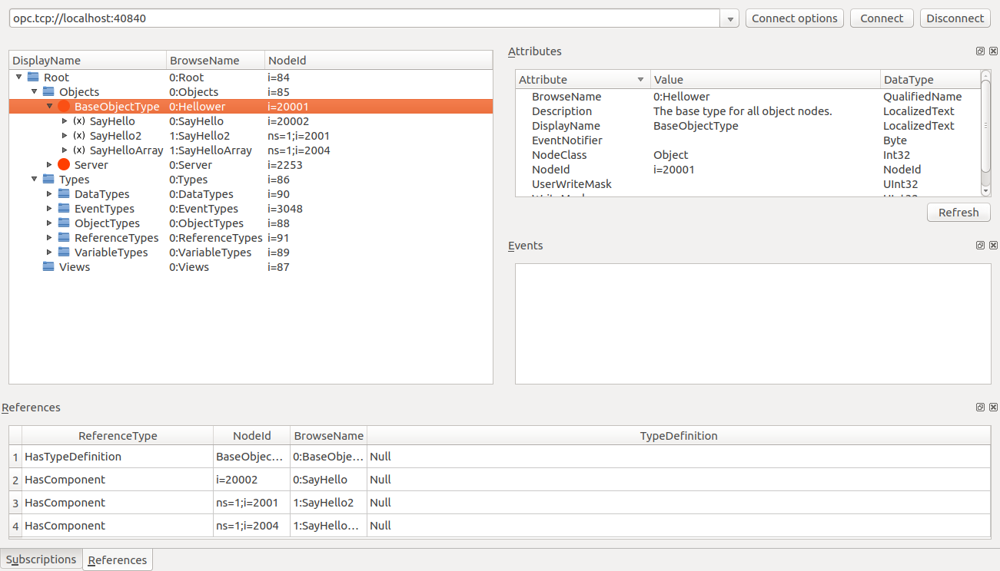

# FreeOpcUa simple-client-server-xml

这份示例主要是说明，方法可以在xml中定义，也可以在代码中定义，xml中定义相对来说比较方便修改，代码中写就存在局限性。


## Source Code 

* https://github.com/FreeOpcUa/python-opcua/blob/master/examples/simple-client-server-xml/server.py
* https://github.com/FreeOpcUa/python-opcua/blob/master/examples/simple-client-server-xml/client_minimal.py
* https://github.com/FreeOpcUa/python-opcua/blob/master/examples/simple-client-server-xml/test_saying.xml

## Output

### Server

```Shell
aplex@aplex:~/zengjf/zengjfos/OpcUaDocs/python-opcua/examples/simple-client-server-xml$ python3 server.py 
Listening on 0.0.0.0:40840
Python 3.5.2+ (default, Sep 22 2016, 12:18:14) 
[GCC 6.2.0 20160927] on linux
Type "help", "copyright", "credits" or "license" for more information.
(InteractiveConsole)
>>> Calling say_hello_xml
I'm not happy
I'm happy
I'm not happy
Cleanup client connection:  ('127.0.0.1', 50448)
```

### Client

```Shell
aplex@aplex:~/zengjf/zengjfos/OpcUaDocs/python-opcua/examples/simple-client-server-xml$ python3 client_minimal.py 
Root node is:  Node(TwoByteNodeId(i=84))
Objects node is:  Node(TwoByteNodeId(i=85))
Hellower is:  Node(NumericNodeId(i=20001))
I'm not happy
I'm happy
["I'm not happy", 'Actually I am']
```

### opcua-client-gui



## XML

```XML
<?xml version='1.0' encoding='utf-8'?>
<UANodeSet xmlns="http://opcfoundation.org/UA/2011/03/UANodeSet.xsd" xmlns:uax="http://opcfoundation.org/UA/2008/02/Types.xsd" xmlns:xsd="http://www.w3.org/2001/XMLSchema" xmlns:xsi="http://www.w3.org/2001/XMLSchema-instance">
  <Aliases>
    <Alias Alias="Organizes">i=35</Alias>
    <Alias Alias="HasTypeDefinition">i=40</Alias>
    <Alias Alias="HasProperty">i=46</Alias>
    <Alias Alias="HasComponent">i=47</Alias>
    <Alias Alias="Argument">i=296</Alias>
  </Aliases>
  <NamespaceUris />
  <UAObject BrowseName="0:Hellower" NodeId="i=20001" ParentNodeId="i=85">
    <DisplayName>BaseObjectType</DisplayName>
    <Description>The base type for all object nodes.</Description>
    <References>
      <Reference IsForward="false" ReferenceType="Organizes">i=85</Reference>
      <Reference ReferenceType="HasTypeDefinition">i=58</Reference>
      <Reference ReferenceType="HasComponent">i=20002</Reference>
    </References>
  </UAObject>
  <UAMethod BrowseName="0:SayHello" NodeId="i=20002" ParentNodeId="i=20001">
    <DisplayName>SayHello</DisplayName>
    <Description>SayHello</Description>
    <References>
      <Reference IsForward="false" ReferenceType="HasComponent">i=20001</Reference>
      <Reference ReferenceType="HasProperty">i=20003</Reference>
      <Reference ReferenceType="HasProperty">i=20004</Reference>
    </References>
  </UAMethod>
  <UAVariable BrowseName="0:InputArguments" DataType="Argument" NodeId="i=20003" ParentNodeId="i=20002" ValueRank="0">
    <DisplayName>InputArguments</DisplayName>
    <Description>InputArguments</Description>
    <Value>
      <uax:ListOfExtensionObject>
        <uax:ExtensionObject>
          <uax:TypeId>
            <uax:Identifier>i=296</uax:Identifier>
          </uax:TypeId>
          <uax:Body>
            <uax:Argument>
              <uax:ValueRank>-1</uax:ValueRank>
              <uax:Description>
                <uax:Text />
                <uax:Locale />
              </uax:Description>
              <uax:DataType>
                <uax:Identifier>i=1</uax:Identifier>
              </uax:DataType>
              <uax:Name>happy</uax:Name>
              <uax:ArrayDimensions />
            </uax:Argument>
          </uax:Body>
        </uax:ExtensionObject>
      </uax:ListOfExtensionObject>
    </Value>
    <References>
      <Reference IsForward="false" ReferenceType="HasProperty">i=20002</Reference>
      <Reference ReferenceType="HasTypeDefinition">i=68</Reference>
    </References>
  </UAVariable>
  <UAVariable BrowseName="0:OutputArguments" DataType="Argument" NodeId="i=20004" ParentNodeId="i=20002" ValueRank="0">
    <DisplayName>OutputArguments</DisplayName>
    <Description>OutputArguments</Description>
    <Value>
      <uax:ListOfExtensionObject>
        <uax:ExtensionObject>
          <uax:TypeId>
            <uax:Identifier>i=296</uax:Identifier>
          </uax:TypeId>
          <uax:Body>
            <uax:Argument>
              <uax:ValueRank>-1</uax:ValueRank>
              <uax:Description>
                <uax:Text />
                <uax:Locale />
              </uax:Description>
              <uax:DataType>
                <uax:Identifier>i=12</uax:Identifier>
              </uax:DataType>
              <uax:Name>saying</uax:Name>
              <uax:ArrayDimensions />
            </uax:Argument>
          </uax:Body>
        </uax:ExtensionObject>
      </uax:ListOfExtensionObject>
    </Value>
    <References>
      <Reference IsForward="false" ReferenceType="HasProperty">i=20002</Reference>
      <Reference ReferenceType="HasTypeDefinition">i=68</Reference>
    </References>
  </UAVariable>
</UANodeSet>
```
