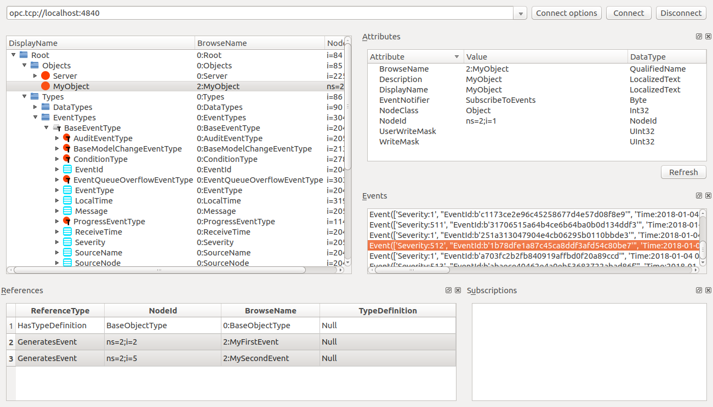

# FreeOpcUa Events

## Source Code

* https://github.com/FreeOpcUa/python-opcua/blob/master/examples/client-events.py
* https://github.com/FreeOpcUa/python-opcua/blob/master/examples/server-events.py

## Server Register Events Message

### Server Register Events

```Python
# Creating a custom event: Approach 1
# The custom event object automatically will have members from its parent (BaseEventType)
etype = server.create_custom_event_type(idx, 'MyFirstEvent', ua.ObjectIds.BaseEventType, [('MyNumericProperty', ua.VariantType.Float), ('MyStringProperty', ua.VariantType.String)])

myevgen = server.get_event_generator(etype, myobj)

# Creating a custom event: Approach 2
custom_etype = server.nodes.base_event_type.add_object_type(2, 'MySecondEvent')
custom_etype.add_property(2, 'MyIntProperty', ua.Variant(0, ua.VariantType.Int32))
custom_etype.add_property(2, 'MyBoolProperty', ua.Variant(True, ua.VariantType.Boolean))

mysecondevgen = server.get_event_generator(custom_etype, myobj)
```

### Server Events Trigger

```Python
# time.sleep is here just because we want to see events in UaExpert
import time
count = 0
while True:
    time.sleep(5)
    myevgen.event.Message = ua.LocalizedText("MyFirstEvent %d" % count)
    myevgen.event.Severity = count
    myevgen.event.MyNumericProperty = count
    myevgen.event.MyStringProperty = "Property " + str(count)
    myevgen.trigger()
    mysecondevgen.trigger(message="MySecondEvent %d" % count)
    count += 1
```

### opcua-client-gui Events Message



```Shell
Event(
    [
        'Severity:1', 
        "EventId:b'a898fc29b67b42069094539466bdf8c0'", 
        'Time:2018-01-04 01:03:15.925638', 
        'ReceiveTime:2018-01-04 01:03:15.925650', 
        'SourceName:MyObject', 
        'SourceNode:NumericNodeId(ns=2;i=1)', 
        'LocalTime:2018-01-04 01:03:15.925654', 
        'Message:LocalizedText(
            Encoding:2, 
            Locale:None, 
            Text:MySecondEvent 158
        )', 
        'EventType:NumericNodeId(
            ns=2;i=5
        )'
    ]
)

Event(
    [
        'Severity:158', 
        "EventId:b'2adb0a523b61443d989c512be2054aac'", 
        'Time:2018-01-04 01:03:15.922734', 
        'ReceiveTime:2018-01-04 01:03:15.922751', 
        'SourceName:MyObject', 
        'SourceNode:NumericNodeId(ns=2;i=1)', 
        'LocalTime:2018-01-04 01:03:15.922756', 
        'Message:LocalizedText(
            Encoding:2, 
            Locale:None, 
            Text:MyFirstEvent 158
        )', 
        'EventType:NumericNodeId(
            ns=2;i=2
        )'
    ]
)
```

## Client Subscription Event Message

### Subscription Event

```Python
class SubHandler(object):

    """
    Subscription Handler. To receive events from server for a subscription
    data_change and event methods are called directly from receiving thread.
    Do not do expensive, slow or network operation there. Create another
    thread if you need to do such a thing
    """
    def event_notification(self, event):
        print("New event recived: ", event)


# Now getting a variable node using its browse path
obj = root.get_child(["0:Objects", "2:MyObject"])
print("MyObject is: ", obj)

myevent = root.get_child(["0:Types", "0:EventTypes", "0:BaseEventType", "2:MyFirstEvent"])
print("MyFirstEventType is: ", myevent)

msclt = SubHandler()
sub = client.create_subscription(100, msclt)
handle = sub.subscribe_events(obj, myevent)
```

### Subscription Event Output

```Shell
>>> New event recived:  
Event(
	[
		'LocalTime:2018-01-04 01:40:45.261248', 
		"EventId:b'0ebda1f20071441382d458150698c5e0'", 
		'Message:LocalizedText(
			Encoding:2, 
			Locale:None, 
			Text:MyFirstEvent 607
		)', 
		'ReceiveTime:2018-01-04 01:40:45.261242', 
		'SourceNode:NumericNodeId(ns=2;i=1)', 
		'Severity:607', 
		'SourceName:MyObject', 
		'EventType:NumericNodeId(ns=2;i=2)', 
		'MyNumericProperty:607.0', 
		'Time:2018-01-04 01:40:45.261224', 
		'MyStringProperty:Property 607'
	]
)
```

