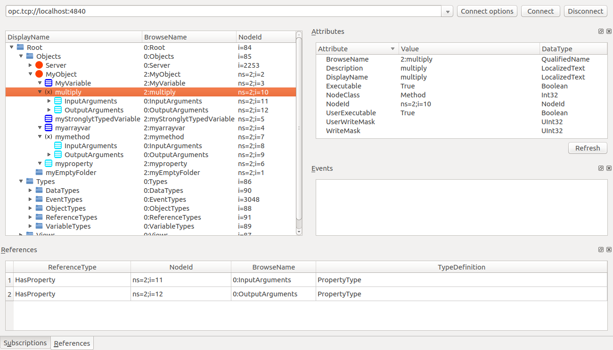

# FreeOpcUa Methods

## Source Code

* https://github.com/FreeOpcUa/python-opcua/blob/master/examples/server-methods.py

## Register Function

```Python
# method to be exposed through server
def func(parent, variant):
    ret = False
    if variant.Value % 2 == 0:
        ret = True
    return [ua.Variant(ret, ua.VariantType.Boolean)]

# method to be exposed through server
# uses a decorator to automatically convert to and from variants

@uamethod
def multiply(parent, x, y):
    print("multiply method call with parameters: ", x, y)
    return x * y

# populating our address space
myfolder = objects.add_folder(idx, "myEmptyFolder")
myobj = objects.add_object(idx, "MyObject")
myvar = myobj.add_variable(idx, "MyVariable", 6.7)
myvar.set_writable()    # Set MyVariable to be writable by clients
myarrayvar = myobj.add_variable(idx, "myarrayvar", [6.7, 7.9])
myarrayvar = myobj.add_variable(idx, "myStronglytTypedVariable", ua.Variant([], ua.VariantType.UInt32))
myprop = myobj.add_property(idx, "myproperty", "I am a property")
mymethod = myobj.add_method(idx, "mymethod", func, [ua.VariantType.Int64], [ua.VariantType.Boolean])

inargx = ua.Argument()
inargx.Name = "x"
inargx.DataType = ua.NodeId(ua.ObjectIds.Int64)
inargx.ValueRank = -1
inargx.ArrayDimensions = []
inargx.Description = ua.LocalizedText("First number x")

inargy = ua.Argument()
inargy.Name = "y"
inargy.DataType = ua.NodeId(ua.ObjectIds.Int64)
inargy.ValueRank = -1
inargy.ArrayDimensions = []
inargy.Description = ua.LocalizedText("Second number y")

outarg = ua.Argument()
outarg.Name = "Result"
outarg.DataType = ua.NodeId(ua.ObjectIds.Int64)
outarg.ValueRank = -1
outarg.ArrayDimensions = []
outarg.Description = ua.LocalizedText("Multiplication result")

multiply_node = myobj.add_method(idx, "multiply", multiply, [inargx, inargy], [outarg])
```

# opcua-client-gui


