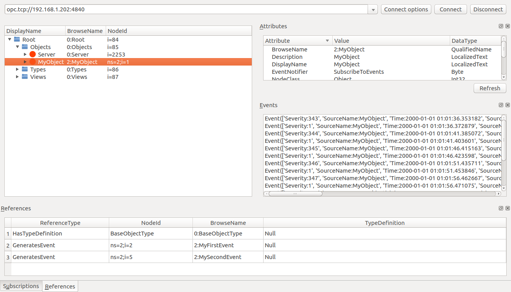

# FreeOpcUa Buildroot Porting

* FreeOpcUa Python版本是纯粹的Python软件包，所以不需要另外交叉编译，所以这里采用板上直接安装的方式进行处理；
* Buildroot不支持在线安装支持包，所以要分析setup.py文件依赖的软件包，需要提前安装好；

## cat setup.py 

```Python
from setuptools import setup, find_packages                             # 让Buildroot Python支持setuptools，Python内核要支持xml

import sys

install_requires = ["python-dateutil", "pytz", "lxml"]                  # 选择好这些依赖模块
if sys.version_info[0] < 3:
    install_requires.extend(["enum34", "trollius", "futures"])          # 版本小于3，要支持这些模块

setup(name="opcua",
      version="0.90.4",
      description="Pure Python OPC-UA client and server library",
      author="Olivier Roulet-Dubonnet",
      author_email="olivier.roulet@gmail.com",
      url='http://freeopcua.github.io/',
      packages=find_packages(),
      provides=["opcua"],
      license="GNU Lesser General Public License v3 or later",
      install_requires=install_requires,
      extras_require={
          'encryption': ['cryptography']                                # 额外需要支持的加密模块
      },
      classifiers=["Programming Language :: Python",
                   "Programming Language :: Python :: 3",
                   "Programming Language :: Python :: 2",
                   "Development Status :: 4 - Beta",
                   "Intended Audience :: Developers",
                   "Operating System :: OS Independent",
                   "License :: OSI Approved :: GNU Lesser General Public License v3 or later (LGPLv3+)",
                   "Topic :: Software Development :: Libraries :: Python Modules",
                   ],
      entry_points={'console_scripts':
                    [
                        'uaread = opcua.tools:uaread',
                        'uals = opcua.tools:uals',
                        'uabrowse = opcua.tools:uals',
                        'uawrite = opcua.tools:uawrite',
                        'uasubscribe = opcua.tools:uasubscribe',
                        'uahistoryread = opcua.tools:uahistoryread',
                        'uaclient = opcua.tools:uaclient',
                        'uaserver = opcua.tools:uaserver',
                        'uadiscover = opcua.tools:uadiscover',
                        'uacall = opcua.tools:uacall',
                    ]
                    }
      )

```

## Install With Output Message

```Shell
# python setup.py install
running install
running bdist_egg
running egg_info
creating opcua.egg-info
writing entry points to opcua.egg-info/entry_points.txt
writing dependency_links to opcua.egg-info/dependency_links.txt
writing top-level names to opcua.egg-info/top_level.txt
writing opcua.egg-info/PKG-INFO
writing requirements to opcua.egg-info/requires.txt
writing manifest file 'opcua.egg-info/SOURCES.txt'
reading manifest file 'opcua.egg-info/SOURCES.txt'
writing manifest file 'opcua.egg-info/SOURCES.txt'
installing library code to build/bdist.linux-armv7l/egg
running install_lib
running build_py
creating build
creating build/lib
creating build/lib/opcua
copying opcua/__init__.py -> build/lib/opcua
copying opcua/compat.py -> build/lib/opcua
copying opcua/tools.py -> build/lib/opcua
creating build/lib/opcua/client
copying opcua/client/client.py -> build/lib/opcua/client
copying opcua/client/__init__.py -> build/lib/opcua/client
copying opcua/client/ua_client.py -> build/lib/opcua/client
creating build/lib/opcua/common
copying opcua/common/methods.py -> build/lib/opcua/common
copying opcua/common/ua_utils.py -> build/lib/opcua/common
copying opcua/common/copy_node.py -> build/lib/opcua/common
copying opcua/common/instantiate.py -> build/lib/opcua/common
copying opcua/common/xmlimporter.py -> build/lib/opcua/common
copying opcua/common/utils.py -> build/lib/opcua/common
copying opcua/common/node.py -> build/lib/opcua/common
copying opcua/common/__init__.py -> build/lib/opcua/common
copying opcua/common/events.py -> build/lib/opcua/common
copying opcua/common/subscription.py -> build/lib/opcua/common
copying opcua/common/xmlexporter.py -> build/lib/opcua/common
copying opcua/common/event_objects.py -> build/lib/opcua/common
copying opcua/common/callback.py -> build/lib/opcua/common
copying opcua/common/xmlparser.py -> build/lib/opcua/common
copying opcua/common/manage_nodes.py -> build/lib/opcua/common
copying opcua/common/connection.py -> build/lib/opcua/common
copying opcua/common/structures.py -> build/lib/opcua/common
copying opcua/common/shortcuts.py -> build/lib/opcua/common
creating build/lib/opcua/crypto
copying opcua/crypto/uacrypto.py -> build/lib/opcua/crypto
copying opcua/crypto/__init__.py -> build/lib/opcua/crypto
copying opcua/crypto/security_policies.py -> build/lib/opcua/crypto
creating build/lib/opcua/server
copying opcua/server/history.py -> build/lib/opcua/server
copying opcua/server/history_sql.py -> build/lib/opcua/server
copying opcua/server/__init__.py -> build/lib/opcua/server
copying opcua/server/uaprocessor.py -> build/lib/opcua/server
copying opcua/server/internal_server.py -> build/lib/opcua/server
copying opcua/server/internal_subscription.py -> build/lib/opcua/server
copying opcua/server/event_generator.py -> build/lib/opcua/server
copying opcua/server/binary_server_asyncio.py -> build/lib/opcua/server
copying opcua/server/subscription_service.py -> build/lib/opcua/server
copying opcua/server/server.py -> build/lib/opcua/server
copying opcua/server/users.py -> build/lib/opcua/server
copying opcua/server/address_space.py -> build/lib/opcua/server
creating build/lib/opcua/ua
copying opcua/ua/uaprotocol_hand.py -> build/lib/opcua/ua
copying opcua/ua/status_codes.py -> build/lib/opcua/ua
copying opcua/ua/__init__.py -> build/lib/opcua/ua
copying opcua/ua/ua_binary.py -> build/lib/opcua/ua
copying opcua/ua/attribute_ids.py -> build/lib/opcua/ua
copying opcua/ua/uaprotocol_auto.py -> build/lib/opcua/ua
copying opcua/ua/object_ids.py -> build/lib/opcua/ua
copying opcua/ua/uatypes.py -> build/lib/opcua/ua
creating build/lib/opcua/server/standard_address_space
copying opcua/server/standard_address_space/standard_address_space_part9.py -> build/lib/opcua/server/standard_address_space
copying opcua/server/standard_address_space/__init__.py -> build/lib/opcua/server/standard_address_space
copying opcua/server/standard_address_space/standard_address_space_part13.py -> build/lib/opcua/server/standard_address_space
copying opcua/server/standard_address_space/standard_address_space_part11.py -> build/lib/opcua/server/standard_address_space
copying opcua/server/standard_address_space/standard_address_space.py -> build/lib/opcua/server/standard_address_space
copying opcua/server/standard_address_space/standard_address_space_part4.py -> build/lib/opcua/server/standard_address_space
copying opcua/server/standard_address_space/standard_address_space_part8.py -> build/lib/opcua/server/standard_address_space
copying opcua/server/standard_address_space/standard_address_space_part10.py -> build/lib/opcua/server/standard_address_space
copying opcua/server/standard_address_space/standard_address_space_part3.py -> build/lib/opcua/server/standard_address_space
copying opcua/server/standard_address_space/standard_address_space_part5.py -> build/lib/opcua/server/standard_address_space
creating build/lib/opcua/ua/uaerrors
copying opcua/ua/uaerrors/__init__.py -> build/lib/opcua/ua/uaerrors
copying opcua/ua/uaerrors/_base.py -> build/lib/opcua/ua/uaerrors
copying opcua/ua/uaerrors/_auto.py -> build/lib/opcua/ua/uaerrors
creating build/bdist.linux-armv7l
creating build/bdist.linux-armv7l/egg
creating build/bdist.linux-armv7l/egg/opcua
creating build/bdist.linux-armv7l/egg/opcua/client
copying build/lib/opcua/client/client.py -> build/bdist.linux-armv7l/egg/opcua/client
copying build/lib/opcua/client/__init__.py -> build/bdist.linux-armv7l/egg/opcua/client
copying build/lib/opcua/client/ua_client.py -> build/bdist.linux-armv7l/egg/opcua/client
copying build/lib/opcua/__init__.py -> build/bdist.linux-armv7l/egg/opcua
creating build/bdist.linux-armv7l/egg/opcua/common
copying build/lib/opcua/common/methods.py -> build/bdist.linux-armv7l/egg/opcua/common
copying build/lib/opcua/common/ua_utils.py -> build/bdist.linux-armv7l/egg/opcua/common
copying build/lib/opcua/common/copy_node.py -> build/bdist.linux-armv7l/egg/opcua/common
copying build/lib/opcua/common/instantiate.py -> build/bdist.linux-armv7l/egg/opcua/common
copying build/lib/opcua/common/xmlimporter.py -> build/bdist.linux-armv7l/egg/opcua/common
copying build/lib/opcua/common/utils.py -> build/bdist.linux-armv7l/egg/opcua/common
copying build/lib/opcua/common/node.py -> build/bdist.linux-armv7l/egg/opcua/common
copying build/lib/opcua/common/__init__.py -> build/bdist.linux-armv7l/egg/opcua/common
copying build/lib/opcua/common/events.py -> build/bdist.linux-armv7l/egg/opcua/common
copying build/lib/opcua/common/subscription.py -> build/bdist.linux-armv7l/egg/opcua/common
copying build/lib/opcua/common/xmlexporter.py -> build/bdist.linux-armv7l/egg/opcua/common
copying build/lib/opcua/common/event_objects.py -> build/bdist.linux-armv7l/egg/opcua/common
copying build/lib/opcua/common/callback.py -> build/bdist.linux-armv7l/egg/opcua/common
copying build/lib/opcua/common/xmlparser.py -> build/bdist.linux-armv7l/egg/opcua/common
copying build/lib/opcua/common/manage_nodes.py -> build/bdist.linux-armv7l/egg/opcua/common
copying build/lib/opcua/common/connection.py -> build/bdist.linux-armv7l/egg/opcua/common
copying build/lib/opcua/common/structures.py -> build/bdist.linux-armv7l/egg/opcua/common
copying build/lib/opcua/common/shortcuts.py -> build/bdist.linux-armv7l/egg/opcua/common
creating build/bdist.linux-armv7l/egg/opcua/crypto
copying build/lib/opcua/crypto/uacrypto.py -> build/bdist.linux-armv7l/egg/opcua/crypto
copying build/lib/opcua/crypto/__init__.py -> build/bdist.linux-armv7l/egg/opcua/crypto
copying build/lib/opcua/crypto/security_policies.py -> build/bdist.linux-armv7l/egg/opcua/crypto
copying build/lib/opcua/compat.py -> build/bdist.linux-armv7l/egg/opcua
creating build/bdist.linux-armv7l/egg/opcua/server
copying build/lib/opcua/server/history.py -> build/bdist.linux-armv7l/egg/opcua/server
copying build/lib/opcua/server/history_sql.py -> build/bdist.linux-armv7l/egg/opcua/server
copying build/lib/opcua/server/__init__.py -> build/bdist.linux-armv7l/egg/opcua/server
copying build/lib/opcua/server/uaprocessor.py -> build/bdist.linux-armv7l/egg/opcua/server
copying build/lib/opcua/server/internal_server.py -> build/bdist.linux-armv7l/egg/opcua/server
copying build/lib/opcua/server/internal_subscription.py -> build/bdist.linux-armv7l/egg/opcua/server
copying build/lib/opcua/server/event_generator.py -> build/bdist.linux-armv7l/egg/opcua/server
copying build/lib/opcua/server/binary_server_asyncio.py -> build/bdist.linux-armv7l/egg/opcua/server
copying build/lib/opcua/server/subscription_service.py -> build/bdist.linux-armv7l/egg/opcua/server
copying build/lib/opcua/server/server.py -> build/bdist.linux-armv7l/egg/opcua/server
copying build/lib/opcua/server/users.py -> build/bdist.linux-armv7l/egg/opcua/server
copying build/lib/opcua/server/address_space.py -> build/bdist.linux-armv7l/egg/opcua/server
creating build/bdist.linux-armv7l/egg/opcua/server/standard_address_space
copying build/lib/opcua/server/standard_address_space/standard_address_space_part9.py -> build/bdist.linux-armv7l/egg/opcua/server/standard_address_space
copying build/lib/opcua/server/standard_address_space/__init__.py -> build/bdist.linux-armv7l/egg/opcua/server/standard_address_space
copying build/lib/opcua/server/standard_address_space/standard_address_space_part13.py -> build/bdist.linux-armv7l/egg/opcua/server/standard_address_space
copying build/lib/opcua/server/standard_address_space/standard_address_space_part11.py -> build/bdist.linux-armv7l/egg/opcua/server/standard_address_space
copying build/lib/opcua/server/standard_address_space/standard_address_space.py -> build/bdist.linux-armv7l/egg/opcua/server/standard_address_space
copying build/lib/opcua/server/standard_address_space/standard_address_space_part4.py -> build/bdist.linux-armv7l/egg/opcua/server/standard_address_space
copying build/lib/opcua/server/standard_address_space/standard_address_space_part8.py -> build/bdist.linux-armv7l/egg/opcua/server/standard_address_space
copying build/lib/opcua/server/standard_address_space/standard_address_space_part10.py -> build/bdist.linux-armv7l/egg/opcua/server/standard_address_space
copying build/lib/opcua/server/standard_address_space/standard_address_space_part3.py -> build/bdist.linux-armv7l/egg/opcua/server/standard_address_space
copying build/lib/opcua/server/standard_address_space/standard_address_space_part5.py -> build/bdist.linux-armv7l/egg/opcua/server/standard_address_space
copying build/lib/opcua/tools.py -> build/bdist.linux-armv7l/egg/opcua
creating build/bdist.linux-armv7l/egg/opcua/ua
copying build/lib/opcua/ua/uaprotocol_hand.py -> build/bdist.linux-armv7l/egg/opcua/ua
copying build/lib/opcua/ua/status_codes.py -> build/bdist.linux-armv7l/egg/opcua/ua
copying build/lib/opcua/ua/__init__.py -> build/bdist.linux-armv7l/egg/opcua/ua
copying build/lib/opcua/ua/ua_binary.py -> build/bdist.linux-armv7l/egg/opcua/ua
copying build/lib/opcua/ua/attribute_ids.py -> build/bdist.linux-armv7l/egg/opcua/ua
copying build/lib/opcua/ua/uaprotocol_auto.py -> build/bdist.linux-armv7l/egg/opcua/ua
creating build/bdist.linux-armv7l/egg/opcua/ua/uaerrors
copying build/lib/opcua/ua/uaerrors/__init__.py -> build/bdist.linux-armv7l/egg/opcua/ua/uaerrors
copying build/lib/opcua/ua/uaerrors/_base.py -> build/bdist.linux-armv7l/egg/opcua/ua/uaerrors
copying build/lib/opcua/ua/uaerrors/_auto.py -> build/bdist.linux-armv7l/egg/opcua/ua/uaerrors
copying build/lib/opcua/ua/object_ids.py -> build/bdist.linux-armv7l/egg/opcua/ua
copying build/lib/opcua/ua/uatypes.py -> build/bdist.linux-armv7l/egg/opcua/ua
byte-compiling build/bdist.linux-armv7l/egg/opcua/client/client.py to client.cpython-35.pyc
byte-compiling build/bdist.linux-armv7l/egg/opcua/client/__init__.py to __init__.cpython-35.pyc
byte-compiling build/bdist.linux-armv7l/egg/opcua/client/ua_client.py to ua_client.cpython-35.pyc
byte-compiling build/bdist.linux-armv7l/egg/opcua/__init__.py to __init__.cpython-35.pyc
byte-compiling build/bdist.linux-armv7l/egg/opcua/common/methods.py to methods.cpython-35.pyc
byte-compiling build/bdist.linux-armv7l/egg/opcua/common/ua_utils.py to ua_utils.cpython-35.pyc
byte-compiling build/bdist.linux-armv7l/egg/opcua/common/copy_node.py to copy_node.cpython-35.pyc
byte-compiling build/bdist.linux-armv7l/egg/opcua/common/instantiate.py to instantiate.cpython-35.pyc
byte-compiling build/bdist.linux-armv7l/egg/opcua/common/xmlimporter.py to xmlimporter.cpython-35.pyc
byte-compiling build/bdist.linux-armv7l/egg/opcua/common/utils.py to utils.cpython-35.pyc
byte-compiling build/bdist.linux-armv7l/egg/opcua/common/node.py to node.cpython-35.pyc
byte-compiling build/bdist.linux-armv7l/egg/opcua/common/__init__.py to __init__.cpython-35.pyc
byte-compiling build/bdist.linux-armv7l/egg/opcua/common/events.py to events.cpython-35.pyc
byte-compiling build/bdist.linux-armv7l/egg/opcua/common/subscription.py to subscription.cpython-35.pyc
byte-compiling build/bdist.linux-armv7l/egg/opcua/common/xmlexporter.py to xmlexporter.cpython-35.pyc
byte-compiling build/bdist.linux-armv7l/egg/opcua/common/event_objects.py to event_objects.cpython-35.pyc
byte-compiling build/bdist.linux-armv7l/egg/opcua/common/callback.py to callback.cpython-35.pyc
byte-compiling build/bdist.linux-armv7l/egg/opcua/common/xmlparser.py to xmlparser.cpython-35.pyc
byte-compiling build/bdist.linux-armv7l/egg/opcua/common/manage_nodes.py to manage_nodes.cpython-35.pyc
byte-compiling build/bdist.linux-armv7l/egg/opcua/common/connection.py to connection.cpython-35.pyc
byte-compiling build/bdist.linux-armv7l/egg/opcua/common/structures.py to structures.cpython-35.pyc
byte-compiling build/bdist.linux-armv7l/egg/opcua/common/shortcuts.py to shortcuts.cpython-35.pyc
byte-compiling build/bdist.linux-armv7l/egg/opcua/crypto/uacrypto.py to uacrypto.cpython-35.pyc
byte-compiling build/bdist.linux-armv7l/egg/opcua/crypto/__init__.py to __init__.cpython-35.pyc
byte-compiling build/bdist.linux-armv7l/egg/opcua/crypto/security_policies.py to security_policies.cpython-35.pyc
byte-compiling build/bdist.linux-armv7l/egg/opcua/compat.py to compat.cpython-35.pyc
byte-compiling build/bdist.linux-armv7l/egg/opcua/server/history.py to history.cpython-35.pyc
byte-compiling build/bdist.linux-armv7l/egg/opcua/server/history_sql.py to history_sql.cpython-35.pyc
byte-compiling build/bdist.linux-armv7l/egg/opcua/server/__init__.py to __init__.cpython-35.pyc
byte-compiling build/bdist.linux-armv7l/egg/opcua/server/uaprocessor.py to uaprocessor.cpython-35.pyc
byte-compiling build/bdist.linux-armv7l/egg/opcua/server/internal_server.py to internal_server.cpython-35.pyc
byte-compiling build/bdist.linux-armv7l/egg/opcua/server/internal_subscription.py to internal_subscription.cpython-35.pyc
byte-compiling build/bdist.linux-armv7l/egg/opcua/server/event_generator.py to event_generator.cpython-35.pyc
byte-compiling build/bdist.linux-armv7l/egg/opcua/server/binary_server_asyncio.py to binary_server_asyncio.cpython-35.pyc
byte-compiling build/bdist.linux-armv7l/egg/opcua/server/subscription_service.py to subscription_service.cpython-35.pyc
byte-compiling build/bdist.linux-armv7l/egg/opcua/server/server.py to server.cpython-35.pyc
byte-compiling build/bdist.linux-armv7l/egg/opcua/server/users.py to users.cpython-35.pyc
byte-compiling build/bdist.linux-armv7l/egg/opcua/server/address_space.py to address_space.cpython-35.pyc
byte-compiling build/bdist.linux-armv7l/egg/opcua/server/standard_address_space/standard_address_space_part9.py to standard_address_space_part9.cpython-35.pyc
byte-compiling build/bdist.linux-armv7l/egg/opcua/server/standard_address_space/__init__.py to __init__.cpython-35.pyc
byte-compiling build/bdist.linux-armv7l/egg/opcua/server/standard_address_space/standard_address_space_part13.py to standard_address_space_part13.cpython-35.pyc
byte-compiling build/bdist.linux-armv7l/egg/opcua/server/standard_address_space/standard_address_space_part11.py to standard_address_space_part11.cpython-35.pyc
byte-compiling build/bdist.linux-armv7l/egg/opcua/server/standard_address_space/standard_address_space.py to standard_address_space.cpython-35.pyc
byte-compiling build/bdist.linux-armv7l/egg/opcua/server/standard_address_space/standard_address_space_part4.py to standard_address_space_part4.cpython-35.pyc
byte-compiling build/bdist.linux-armv7l/egg/opcua/server/standard_address_space/standard_address_space_part8.py to standard_address_space_part8.cpython-35.pyc
byte-compiling build/bdist.linux-armv7l/egg/opcua/server/standard_address_space/standard_address_space_part10.py to standard_address_space_part10.cpython-35.pyc
byte-compiling build/bdist.linux-armv7l/egg/opcua/server/standard_address_space/standard_address_space_part3.py to standard_address_space_part3.cpython-35.pyc
byte-compiling build/bdist.linux-armv7l/egg/opcua/server/standard_address_space/standard_address_space_part5.py to standard_address_space_part5.cpython-35.pyc
byte-compiling build/bdist.linux-armv7l/egg/opcua/tools.py to tools.cpython-35.pyc
byte-compiling build/bdist.linux-armv7l/egg/opcua/ua/uaprotocol_hand.py to uaprotocol_hand.cpython-35.pyc
byte-compiling build/bdist.linux-armv7l/egg/opcua/ua/status_codes.py to status_codes.cpython-35.pyc
byte-compiling build/bdist.linux-armv7l/egg/opcua/ua/__init__.py to __init__.cpython-35.pyc
byte-compiling build/bdist.linux-armv7l/egg/opcua/ua/ua_binary.py to ua_binary.cpython-35.pyc
byte-compiling build/bdist.linux-armv7l/egg/opcua/ua/attribute_ids.py to attribute_ids.cpython-35.pyc
byte-compiling build/bdist.linux-armv7l/egg/opcua/ua/uaprotocol_auto.py to uaprotocol_auto.cpython-35.pyc
byte-compiling build/bdist.linux-armv7l/egg/opcua/ua/uaerrors/__init__.py to __init__.cpython-35.pyc
byte-compiling build/bdist.linux-armv7l/egg/opcua/ua/uaerrors/_base.py to _base.cpython-35.pyc
byte-compiling build/bdist.linux-armv7l/egg/opcua/ua/uaerrors/_auto.py to _auto.cpython-35.pyc
byte-compiling build/bdist.linux-armv7l/egg/opcua/ua/object_ids.py to object_ids.cpython-35.pyc
byte-compiling build/bdist.linux-armv7l/egg/opcua/ua/uatypes.py to uatypes.cpython-35.pyc
creating build/bdist.linux-armv7l/egg/EGG-INFO
copying opcua.egg-info/PKG-INFO -> build/bdist.linux-armv7l/egg/EGG-INFO
copying opcua.egg-info/SOURCES.txt -> build/bdist.linux-armv7l/egg/EGG-INFO
copying opcua.egg-info/dependency_links.txt -> build/bdist.linux-armv7l/egg/EGG-INFO
copying opcua.egg-info/entry_points.txt -> build/bdist.linux-armv7l/egg/EGG-INFO
copying opcua.egg-info/requires.txt -> build/bdist.linux-armv7l/egg/EGG-INFO
copying opcua.egg-info/top_level.txt -> build/bdist.linux-armv7l/egg/EGG-INFO
zip_safe flag not set; analyzing archive contents...
creating dist
creating 'dist/opcua-0.90.4-py3.5.egg' and adding 'build/bdist.linux-armv7l/egg' to it
removing 'build/bdist.linux-armv7l/egg' (and everything under it)
Processing opcua-0.90.4-py3.5.egg
Copying opcua-0.90.4-py3.5.egg to /usr/lib/python3.5/site-packages
Adding opcua 0.90.4 to easy-install.pth file
Installing uabrowse script to /usr/bin
Installing uahistoryread script to /usr/bin
Installing uaclient script to /usr/bin
Installing uadiscover script to /usr/bin
Installing uaread script to /usr/bin
Installing uacall script to /usr/bin
Installing uals script to /usr/bin
Installing uaserver script to /usr/bin
Installing uasubscribe script to /usr/bin
Installing uawrite script to /usr/bin

Installed /usr/lib/python3.5/site-packages/opcua-0.90.4-py3.5.egg
Processing dependencies for opcua==0.90.4
Searching for lxml==3.7.2
Best match: lxml 3.7.2
Adding lxml 3.7.2 to easy-install.pth file

Using /usr/lib/python3.5/site-packages
Searching for pytz==2016.10
Best match: pytz 2016.10
Adding pytz 2016.10 to easy-install.pth file

Using /usr/lib/python3.5/site-packages
Searching for python-dateutil==2.6.0
Best match: python-dateutil 2.6.0
Adding python-dateutil 2.6.0 to easy-install.pth file

Using /usr/lib/python3.5/site-packages
Searching for six==1.10.0
Best match: six 1.10.0
Adding six 1.10.0 to easy-install.pth file

Using /usr/lib/python3.5/site-packages
Finished processing dependencies for opcua==0.90.4
```

## Command Line Test FreeOpcUa

```Shell
# ls
certificate-example.der           server-callback.py
client-events.py                  server-custom-object.py
client-example.py                 server-datavalue-history.py
client-minimal.py                 server-enum.py
client_deleting.py                server-events-history.py
client_read-custom_structures.py  server-events.py
client_to_demo-this.com.py        server-example.py
client_to_kepware.py              server-instantiate-object.py
client_to_prosys.py               server-methods.py
client_to_prosys_cert.py          server-minimal.py
client_to_prosys_events.py        server-ua-python-mirror.py
custom_nodes.xml                  server-with-encryption.py
customobject.xml                  server-xmlexporter.py
generate_certificate.sh           simple-client-server-xml
private-key-example.pem           test_perf.py
# python server-events.py &
WARNING:opcua.server.binary_server_asyncio:Listening on 0.0.0.0:4840
# python client-events.py
Objects node is:  Node(TwoByteNodeId(i=84))
MyObject is:  Node(NumericNodeId(ns=2;i=1))
MyFirstEventType is:  Node(NumericNodeId(ns=2;i=2))
DEBUG:opcua.server.internal_subscription:starting subscription 78
INFO:opcua.server.internal_subscription:publish request with acks []
INFO:opcua.server.internal_subscription:publish request with acks []
INFO:opcua.server.internal_subscription:publish request with acks [1]
INFO:opcua.server.internal_subscription.78:request to subscribe to events for node NumericNodeId(ns=2;i=1) and attribute 12
DEBUG:opcua.server.internal_subscription.78:Creating MonitoredItem with id 112
Python 3.5.2 (default, Jan  4 2018, 12:11:31)
[GCC 4.9.4] on linux
Type "help", "copyright", "credits" or "license" for more information.
(InteractiveConsole)
>>> DEBUG:opcua.server.internal_subscription.78:<opcua.server.internal_subscription.MonitoredItemService object at 0x2c445390> has subscription for events CustomEvent(['Time:2000-01-01 00:33:23.902248', 'LocalTime:2000-01-01 00:33:23.902342', 'MyStringProperty:Property 5', 'MyNumericProperty:5', 'SourceNode:NumericNodeId(ns=2;i=1)', 'Severity:5', 'Message:LocalizedText(Encoding:2, Locale:None, Text:MyFirstEvent 5)', 'SourceName:MyObject', '_freeze:True', "EventId:Variant(val:b'5f3d8feac9484081b1f560c130cf647c',type:VariantType.ByteString)", 'EventType:NumericNodeId(ns=2;i=2)', 'ReceiveTime:2000-01-01 00:33:23.902305']) from node: NumericNodeId(ns=2;i=1)
DEBUG:opcua.server.internal_subscription.78:<opcua.server.internal_subscription.MonitoredItemService object at 0x2c445390> has subscription for events CustomEvent(['Time:2000-01-01 00:33:23.914119', 'LocalTime:2000-01-01 00:33:23.914164', 'SourceNode:NumericNodeId(ns=2;i=1)', 'Severity:1', 'Message:LocalizedText(Encoding:2, Locale:None, Text:MySecondEvent 5)', 'SourceName:MyObject', 'MyIntProperty:0', '_freeze:True', "EventId:Variant(val:b'e812c5527c37448a90d7836323229085',type:VariantType.ByteString)", 'EventType:NumericNodeId(ns=2;i=5)', 'MyBoolProperty:True', 'ReceiveTime:2000-01-01 00:33:23.914148']) from node: NumericNodeId(ns=2;i=1)
INFO:opcua.server.internal_subscription.78:<opcua.server.internal_subscription.MonitoredItemService object at 0x2c445390>, 112, Event CustomEvent(['Time:2000-01-01 00:33:23.914119', 'LocalTime:2000-01-01 00:33:23.914164', 'SourceNode:NumericNodeId(ns=2;i=1)', 'Severity:1', 'Message:LocalizedText(Encoding:2, Locale:None, Text:MySecondEvent 5)', 'SourceName:MyObject', 'MyIntProperty:0', '_freeze:True', "EventId:Variant(val:b'e812c5527c37448a90d7836323229085',type:VariantType.ByteString)", 'EventType:NumericNodeId(ns=2;i=5)', 'MyBoolProperty:True', 'ReceiveTime:2000-01-01 00:33:23.914148']) does not fit WhereClause, not generating event
DEBUG:opcua.server.internal_subscription:sending event notification with 1 events
New event recived:  Event(['SourceName:MyObject', 'EventType:NumericNodeId(ns=2;i=2)', 'MyStringProperty:Property 5', "EventId:b'5f3d8feac9484081b1f560c130cf647c'", 'SourceNode:NumericNodeId(ns=2;i=1)', 'MyNumericProperty:5.0', 'Message:LocalizedText(Encoding:2, Locale:None, Text:MyFirstEvent 5)', 'ReceiveTime:2000-01-01 00:33:23.902305', 'Severity:5', 'LocalTime:2000-01-01 00:33:23.902342', 'Time:2000-01-01 00:33:23.902248'])
INFO:opcua.server.internal_subscription:publish request with acks [1]
DEBUG:opcua.server.internal_subscription.78:<opcua.server.internal_subscription.MonitoredItemService object at 0x2c445390> has subscription for events CustomEvent(['Time:2000-01-01 00:33:28.923183', 'LocalTime:2000-01-01 00:33:28.923289', 'MyStringProperty:Property 6', 'MyNumericProperty:6', 'SourceNode:NumericNodeId(ns=2;i=1)', 'Severity:6', 'Message:LocalizedText(Encoding:2, Locale:None, Text:MyFirstEvent 6)', 'SourceName:MyObject', '_freeze:True', "EventId:Variant(val:b'8461779424fe42cdbb52ab5bb4fc5d42',type:VariantType.ByteString)", 'EventType:NumericNodeId(ns=2;i=2)', 'ReceiveTime:2000-01-01 00:33:28.923247']) from node: NumericNodeId(ns=2;i=1)
DEBUG:opcua.server.internal_subscription.78:<opcua.server.internal_subscription.MonitoredItemService object at 0x2c445390> has subscription for events CustomEvent(['Time:2000-01-01 00:33:28.937082', 'LocalTime:2000-01-01 00:33:28.937177', 'SourceNode:NumericNodeId(ns=2;i=1)', 'Severity:1', 'Message:LocalizedText(Encoding:2, Locale:None, Text:MySecondEvent 6)', 'SourceName:MyObject', 'MyIntProperty:0', '_freeze:True', "EventId:Variant(val:b'cbecc397a6ef46ea9bf57cbdff676ccb',type:VariantType.ByteString)", 'EventType:NumericNodeId(ns=2;i=5)', 'MyBoolProperty:True', 'ReceiveTime:2000-01-01 00:33:28.937141']) from node: NumericNodeId(ns=2;i=1)
INFO:opcua.server.internal_subscription.78:<opcua.server.internal_subscription.MonitoredItemService object at 0x2c445390>, 112, Event CustomEvent(['Time:2000-01-01 00:33:28.937082', 'LocalTime:2000-01-01 00:33:28.937177', 'SourceNode:NumericNodeId(ns=2;i=1)', 'Severity:1', 'Message:LocalizedText(Encoding:2, Locale:None, Text:MySecondEvent 6)', 'SourceName:MyObject', 'MyIntProperty:0', '_freeze:True', "EventId:Variant(val:b'cbecc397a6ef46ea9bf57cbdff676ccb',type:VariantType.ByteString)", 'EventType:NumericNodeId(ns=2;i=5)', 'MyBoolProperty:True', 'ReceiveTime:2000-01-01 00:33:28.937141']) does not fit WhereClause, not generating event
DEBUG:opcua.server.internal_subscription:sending event notification with 1 events
New event recived:  Event(['SourceName:MyObject', 'EventType:NumericNodeId(ns=2;i=2)', 'MyStringProperty:Property 6', "EventId:b'8461779424fe42cdbb52ab5bb4fc5d42'", 'SourceNode:NumericNodeId(ns=2;i=1)', 'MyNumericProperty:6.0', 'Message:LocalizedText(Encoding:2, Locale:None, Text:MyFirstEvent 6)', 'ReceiveTime:2000-01-01 00:33:28.923247', 'Severity:6', 'LocalTime:2000-01-01 00:33:28.923289', 'Time:2000-01-01 00:33:28.923183'])
INFO:opcua.server.internal_subscription:publish request with acks [2]
...
quit()
DEBUG:opcua.server.internal_subscription:stopping subscription 78
DEBUG:opcua.server.internal_subscription.78:delete monitored items [112]
```

## opcua-client-gui


